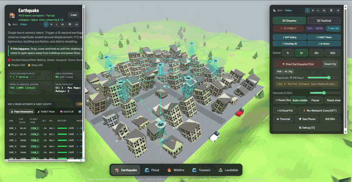
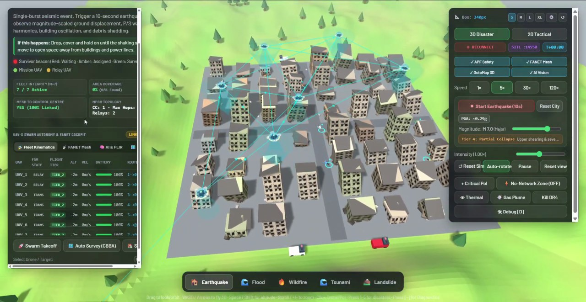
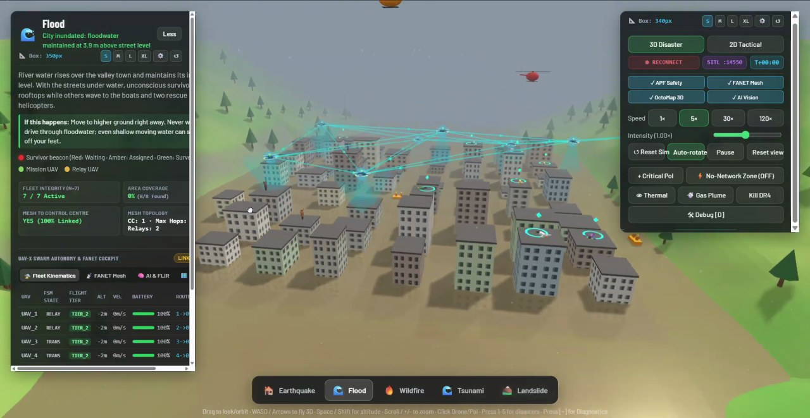
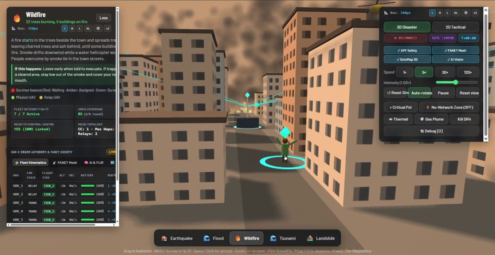
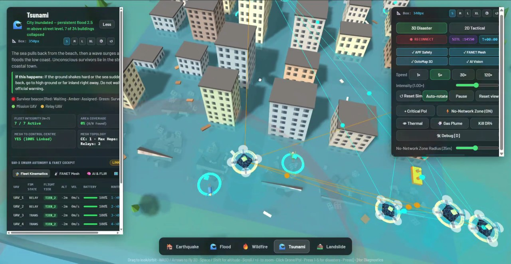
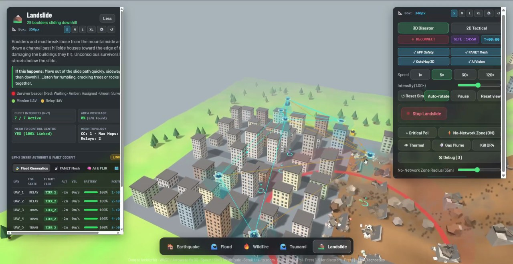
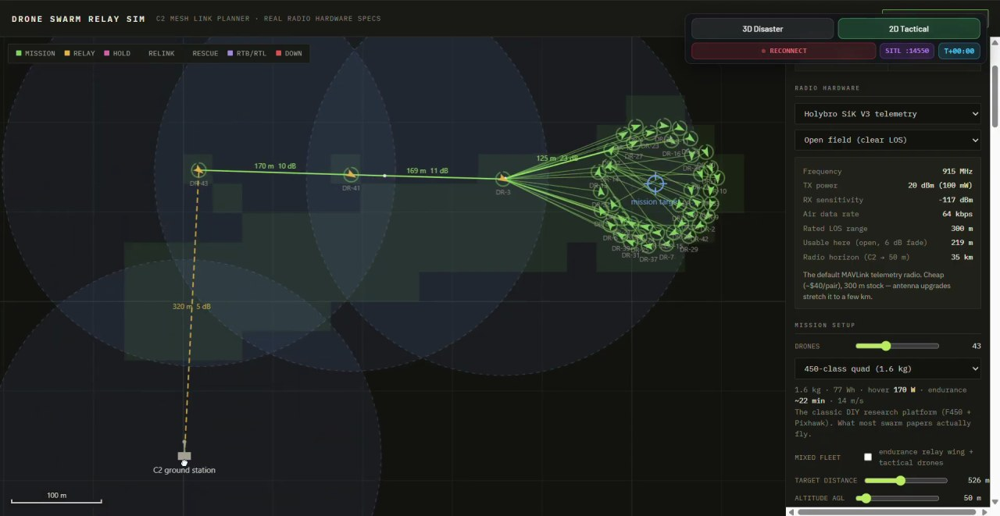
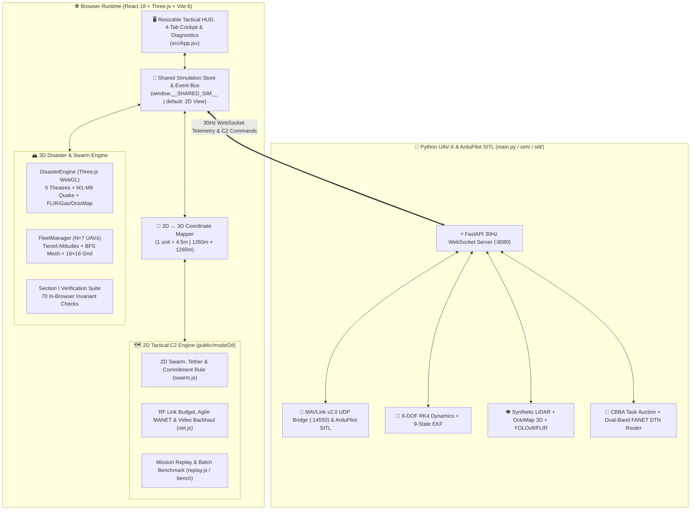
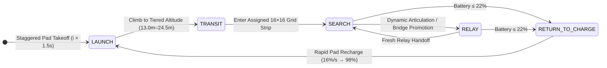
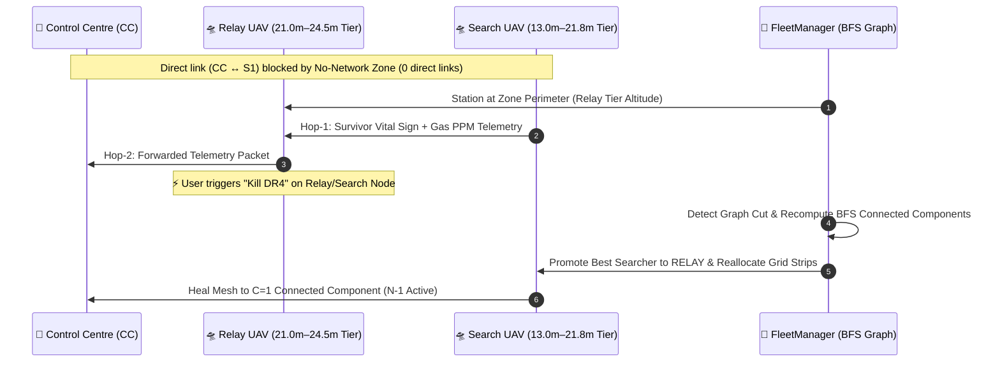

<div align="center">

# 🚁 UAV-X Disaster-Response Swarm Platform `v6.0`

### **Autonomous Multi-UAV Swarm Coordination • Multi-Hop FANET Mesh • 3D/2D Synchronized Digital Twin**

### 🌐 **Live Demo : [https://sih-alpha-silk.vercel.app/](https://sih-alpha-silk.vercel.app/)**

[](https://sih-alpha-silk.vercel.app/)
[](https://drive.google.com/file/d/1btd9Z9shN5KIlfis-gstKrpfiNMgCR28/view?usp=drive_link)
[](package.json)
[](https://react.dev/)
[](https://threejs.org/)
[](https://vitejs.dev/)
[](main.py)
[](scripts/headless_verifier.js)
[](src/simulation/verificationSuite.js)
[](public/model2d/REVIEW-FIXES.md)

<br />

<a href="https://drive.google.com/file/d/1btd9Z9shN5KIlfis-gstKrpfiNMgCR28/view?usp=drive_link">
  
</a>

<p align="center">
  📺 <b><a href="https://drive.google.com/file/d/1btd9Z9shN5KIlfis-gstKrpfiNMgCR28/view?usp=drive_link">Watch Full 1080p HD Simulation Video</a></b> •
  🎬 <b><a href="https://raw.githubusercontent.com/piyushmeena-hub/SIH/main/docs/assets/simulation_demo.mp4">Direct MP4 Stream / Download</a></b> •
  🌐 <b><a href="https://sih-alpha-silk.vercel.app/">Launch Interactive Live Demo</a></b>
</p>

<p align="center">
  <a href="#-overview--key-capabilities">Overview</a> •
  <a href="#-live-simulation-visual-showcase">Simulation Showcase</a> •
  <a href="#-5-active-natural-disaster-theatres">Disaster Theatres</a> •
  <a href="#-system-architecture--state-machines">Architecture</a> •
  <a href="#-core-engineering-subsystems">Subsystems</a> •
  <a href="#-uav-x-cockpit--resizable-hud">Cockpit & HUD</a> •
  <a href="#-controls--tactical-hotkeys">Controls</a> •
  <a href="#-automated-verification-suite">Verification</a> •
  <a href="#-quick-start--installation">Quick Start</a>
</p>

</div>

---

## 🌐 Overview & Key Capabilities

**UAV-X (`v6.0.0`)** is an integrated, mission-critical **2D & 3D Autonomous UAV Swarm Disaster-Response Simulation Platform** built with **React 18**, **Three.js (WebGL)**, **Vite 6**, and a **Python FastAPI / MAVLink v2.0 SITL Backend**.

The platform simulates autonomous quadrotor swarm coordination, multi-hop Flying Ad-Hoc Network (**FANET**) relay bridging, tiered 3D Khatib Artificial Potential Field (**APF**) collision avoidance, $16 \times 16$ lawnmower coverage search, and multi-sensor survivor detection across **five active natural disaster environments**: **Earthquake**, **Flood**, **Wildfire**, **Tsunami**, and **Landslide**.

> [!IMPORTANT]
> **Single Source of Truth ($N=7$ Active UAVs):** The platform enforces strict state synchronization across the **3D Three.js WebGL Terrain Engine**, the **2D Tactical C2 & RF Simulator**, the **Reactive Telemetry Store**, and the **BFS Mesh Network Graph**—guaranteeing zero orphan meshes, 100% monotonic search coverage, and continuous single-component network connectivity ($C = 1$).

<div align="center">

| 📊 Operational Metric | 🎯 Specification / Guarantee | 🛠️ Governing Module |
| :--- | :--- | :--- |
| **Canonical Swarm Fleet Size** | $N = 7$ Autonomous Quadrotors (`DR-1` – `DR-7`) | [`fleetManager.js`](src/simulation/fleetManager.js) |
| **Default Startup View** | **2D Tactical C2 View** (`2d`), instant toggle to **3D Disaster View** (`3d`) | [`App.jsx`](src/App.jsx) / [`simulationStore.js`](src/integration/simulationStore.js) |
| **Active Disaster Theatres** | **5 Scenarios**: Earthquake, Flood, Wildfire, Tsunami, Landslide (`1`–`5`) | [`disasterEngine.js`](src/simulation/disasterEngine.js) |
| **Tiered Flight Altitudes** | Search UAVs: $13.0\text{m}–21.8\text{m}$ ($2.2\text{m}$ steps) · Relay UAVs: $21.0\text{m}–24.5\text{m}$ | [`fleetManager.js`](src/simulation/fleetManager.js) |
| **3D Obstacle & Drone Separation** | APF Soft Repulsion ($5.5\text{m}$) + Hard Envelope ($2.0\text{m}$) + Rooftop Clearance | [`fleetManager.js`](src/simulation/fleetManager.js) |
| **FANET Mesh Connectivity** | $1$ Connected Component ($C=1$) to Ground Control Centre (CC) | [`fleetManager.js`](src/simulation/fleetManager.js) / [`network.py`](sim/network.py) |
| **Coverage Grid & Footprint** | $16 \times 16$ Lawnmower Grid ($256$ cells, $R = 16\text{m}$ sensor cone) | [`fleetManager.js`](src/simulation/fleetManager.js) |
| **2D $\leftrightarrow$ 3D Spatial Scale** | $1\text{ Three.js unit} = 4.5\text{m}$ ($280\text{u} \equiv 1,260\text{m} \times 1,260\text{m}$ sector) | [`coordinateMapper.js`](src/integration/coordinateMapper.js) |
| **Automated Verification** | **59/59** Node Checks · **70/70** Browser WebGL Checks · **404/404** 2D Tests | [`verificationSuite.js`](src/simulation/verificationSuite.js) / [`headless_verifier.js`](scripts/headless_verifier.js) |

</div>

---

## 🎬 Live Simulation Visual Showcase

Captured directly from the **[Full 1080p HD Simulation Walkthrough](https://drive.google.com/file/d/1btd9Z9shN5KIlfis-gstKrpfiNMgCR28/view?usp=drive_link)** across all 5 3D disaster environments and the 2D Tactical RF Relay Simulator:

<table align="center" width="100%">
  <tr>
    <td align="center" width="50%">
      <br />
      <b>1. 🏚️ Earthquake (M7.0 Partial Collapse & 3D Mesh)</b><br />
      <sub>Multi-hop cyan FANET links, structural shearing/tilt, PGA readout, and live 4-tab UAV-X Swarm Cockpit.</sub>
    </td>
    <td align="center" width="50%">
      <br />
      <b>2. 🌊 Flood (Sustained Inundation & Aerial/Marine SAR)</b><br />
      <sub>3.9m street inundation, rooftop survivor beacons, navigable waterway boats, and rescue helicopters.</sub>
    </td>
  </tr>
  <tr>
    <td align="center" width="50%">
      <br />
      <b>3. 🔥 Wildfire (Street-Level Survivor Beacon & Smoke)</b><br />
      <sub>Volumetric smoke plumes, urban-core Ground Control Centre, and localized survivor marker at +2.5m.</sub>
    </td>
    <td align="center" width="50%">
      <br />
      <b>4. 🌊 Tsunami (No-Network Zone & APF Safety Spheres)</b><br />
      <sub>Coastal surge inundation with active No-Network Zone perimeter relay routing and 3D APF safety envelopes.</sub>
    </td>
  </tr>
  <tr>
    <td align="center" width="50%">
      <br />
      <b>5. ⛰️ Landslide (Debris Chute & Perimeter Relay Bridging)</b><br />
      <sub>Active boulder/mud slide channel with 35m No-Network denial zone and hop-by-hop amber/cyan mesh links.</sub>
    </td>
    <td align="center" width="50%">
      <br />
      <b>6. 📡 2D Tactical C2 Mesh Link Planner</b><br />
      <sub>Self-healing multi-hop relay chain (170m / 10–23 dB margins), calibrated Holybro SiK 915 MHz specs, and target orbit.</sub>
    </td>
  </tr>
</table>

---

## 🌋 5 Active Natural Disaster Theatres

Every disaster scenario features procedural 3D terrain, dynamic hazard physics, pristine $t=0$ resident states, and a strategically positioned **Ground Control Centre (CC)** stationed safely outside active hazard zones.

| Tab / Key | Scenario | Safe CC Placement | Environmental Physics & Scenario-Specific Controls |
| :---: | :--- | :---: | :--- |
| <kbd>1</kbd> | **🏚️ Earthquake** | `[82, 72]`<br/>*(Outside Urban Bounds)* | **Single-burst 10s seismic event** with Richter slider (**`M 1.0` – `M 9.0`**), live **PGA (`g`)** badge, **5 Damage Tiers** (elastic sway to pancake rubble collapse), **`Reset City`** button, **Thermal FLIR** shader (`👁 Thermal`), and **Volumetric Gas Plume** (`💨 Gas Plume`) with per-drone PPM telemetry. |
| <kbd>2</kbd> | **🌊 Flood** | `[18, 86]`<br/>*(Elevated Hill: $20\text{m} > 7\text{m}$)* | River water rises smoothly over the valley town and **maintains its inundation level**. Unconscious survivors lie on rooftops while others wave to **autonomous waterway-constrained rescue boats** and **two rescue helicopters**. |
| <kbd>3</kbd> | **🔥 Wildfire** | `[36, 26]`<br/>*(Non-Flammable Urban Core)* | Fire ignites in the forest beside town and spreads tree-by-tree, leaving charred trunks and ash until structures ignite. Downwind volumetric smoke plumes, water-dropping helicopter, and staggered radial UAV takeoff. |
| <kbd>4</kbd> | **🌊 Tsunami** | `[-96, 62]` / `[80, 75]`<br/>*(High-Ground Coastal Bluff)* | Sea drawbacks from the shoreline followed by a high-velocity coastal wave surge that floods the low-lying town. Long-range multi-hop UAV relay chain bridges telemetry from inland high ground. |
| <kbd>5</kbd> | **⛰️ Landslide** | `[-82, 74]` / `[80, 70]`<br/>*(Stable Plateau)* | Features interactive **`Start Landslide` / `Stop Landslide`** trigger (`#bSlide`). Boulders and mud break loose from the mountainside, sliding down a channel past hillside homes and damaging structures on impact. |

### Earthquake Structural Damage Tiers (`M 1.0` – `M 9.0`)

| Magnitude Range | Richter Category | Damage Tier | Structural & Visual Response |
| :---: | :---: | :--- | :--- |
| `M 1.0 – 3.9` | Micro / Minor | **Tier 1: No Damage** | Elastic structural sway only; all buildings remain intact |
| `M 4.0 – 5.4` | Light | **Tier 2: Minor Damage** | Hairline facade cracks and broken windows |
| `M 5.5 – 6.9` | Moderate / Strong | **Tier 3: Moderate Damage** | Visible structural tilt, foundation settling, and dust plumes |
| `M 7.0 – 8.1` | Major | **Tier 4: Partial Collapse** | Upper-story shearing, severe building tilt, and street debris |
| `M 8.2 – 9.0` | Great | **Tier 5: Catastrophic** | Pancake collapse into rubble piles; OctoMap 3D voxelization active |

---

## 🏗️ System Architecture & State Machines

### 1. Unified Multi-Engine Architecture



### 2. Autonomous 5-State UAV Kinematic State Machine

Every UAV in [`FleetManager`](src/simulation/fleetManager.js) operates under a deterministic 5-state lifecycle—drones never vanish or sit idle:



### 3. Self-Healing & No-Network Zone Relay Protocol



---

## ⚙️ Core Engineering Subsystems

### 1. Authoritative Swarm Fleet Management (`FleetManager`)
- **Single Source of Truth ($N=7$)**: Configured via `FLEET_CONFIG.DRONE_COUNT = 7` in [`src/simulation/fleetManager.js`](src/simulation/fleetManager.js).
- **Tiered 3D Cruising Altitudes**:
  - **Search UAVs**: Assigned individual altitude layers $h_i = 13.0 + (i \bmod 5) \times 2.2\text{m}$ ($13.0\text{m}$ to $21.8\text{m}$).
  - **Relay UAVs**: Stationed in an elevated overwatch tier $h_r = 21.0 + (i \bmod 2) \times 3.5\text{m}$ ($21.0\text{m}$ to $24.5\text{m}$), ensuring clear line-of-sight (LOS) above urban rooftops and zero physical overlap with searchers.
- **Fault Tolerance & Self-Healing (`Kill DR4` / `Kill DR#` / `Revive`)**:
  - Killing any active UAV immediately disables its node, promotes the nearest suitable search UAV to `RELAY` at relay-tier altitude if needed to keep `connectedComponents === 1`, and redistributes unvisited grid cells across the remaining $N-1$ drones.
  - Clicking **Revive** restores the UAV (` LAUNCH` $\rightarrow$ `SEARCH`) and rebalances the fleet back to $N=7$.

### 2. Guaranteed Multi-Hop FANET Mesh & No-Network Zone
- **Dynamic BFS Connectivity Graph**: Evaluated at every simulation step over active UAVs $\cup \{\text{CC}\}$. Guarantees $100\%$ CC reachability (`allDronesLinked === true`) and finite hop counts.
- **Articulation-Point Motion Protection**: Before committing any movement vector, `wouldBreakConnectivity()` verifies that the candidate position will not sever the multi-hop path of any downstream UAV.
- **No-Network Zone (`15m–60m` Adjustable Radius)**:
  - Direct communication between the Control Centre and any UAV inside the zone is strictly prohibited ($\text{directLinksInsideZone} = 0$).
  - The swarm automatically dispatches perimeter relay drones just outside the zone boundary to bridge telemetry hop-by-hop.

### 3. Volumetric Obstacle Avoidance & Rooftop Clearance
- **Khatib Artificial Potential Field (APF)**: Each UAV samples building bounding boxes with a $6\text{m}$ lookahead vector and applies inter-drone repulsion ($d_{\text{safe}} = 5.5\text{m}$, hard envelope $2.0\text{m}$):

$$\mathbf{F}_{\text{rep}}(\mathbf{p}) = \sum_{b \in \mathcal{B}} \eta \left( \frac{1}{\rho(\mathbf{p}, b)} - \frac{1}{\rho_0} \right) \frac{1}{\rho^2(\mathbf{p}, b)} \nabla \rho(\mathbf{p}, b) \quad \text{for } \rho(\mathbf{p}, b) < \rho_0$$

- **Mandatory Rooftop Clearance**: Hard vertical floor forces UAVs to climb at least $+3.5\text{m}$ above any building rooftop within a $3.2\text{m}$ horizontal margin. Drones never penetrate building volumes.
- **Navigable Waterway Routing**: In the **Flood** scenario, rescue boats steer exclusively along open water channels and avoid submerged building footprints.

### 4. 2D Tactical Distributed Radio & Autonomy Engine (`public/model2d/`)
- **Truth vs. Belief Architecture**: Separates physical truth, C2 knowledge (constructed strictly from received multi-hop packets), and onboard UAV belief states.
- **FASTER-Inspired Commitment Rule**: Before accepting any in-flight order, a UAV verifies that flying to the target still leaves sufficient battery to return home against the vector wind envelope with reserve margin intact.
- **RSSI Tether Rule & Bidirectional Link Recovery**: No drone outruns its upstream link margin; on link loss, drones execute a 3-step fallback ladder (*hold $\rightarrow$ last-link retreat $\rightarrow$ one-hop step back $\rightarrow$ RTL*) while C2 dispatches chained rescue relays.
- **DDIL & Tier-2 Capabilities**: Heterogeneous fleets (mixed airframes & radios), Ornstein-Uhlenbeck dead-reckoning in GPS-denied zones, frequency-hopping anti-jam agility + LPI/LPD, round-robin video backhaul scheduling, red-team direction-finding adversaries, and Cursor-on-Target (**ATAK / TAK**) XML/UDP export.

### 5. Python UAV-X SITL & Perception Backend (`main.py` & `sim/`)
- **FastAPI 30 Hz WebSocket Server (`:8080`) & MAVLink v2.0 Bridge (`:14550`)**: Streams compact $<1.5\text{ KB}$ telemetry frames at $30\text{ Hz}$ and exports `HEARTBEAT`, `SYS_STATUS`, `GLOBAL_POSITION_INT`, and `ATTITUDE` packets to QGroundControl / Mission Planner.
- **6-DOF RK4 Quadrotor Dynamics & 9-State EKF ([`dynamics.py`](sim/dynamics.py), [`perception.py`](sim/perception.py))**: Full rigid-body integration, downwash cylinder avoidance, battery discharge modeling, and Extended Kalman Filter state estimation.
- **OctoMap 3D Log-Odds Voxel Mapping & Shannon Entropy ([`perception.py`](sim/perception.py))**: $360^\circ \times 30^\circ$ synthetic LiDAR raycasting with log-odds occupancy updates and real-time spatial entropy reduction metrics.
- **CBBA Decentralized Task Auction ([`mission.py`](sim/mission.py))**: Consensus-Based Bundle Algorithm for conflict-free multi-UAV task allocation.
- **YOLOv8 + FLIR Thermal Fusion & OpenCV Hazard Tagging ([`vision_fusion.py`](sim/vision_fusion.py))**: Identifies survivor heat signatures ($31^\circ\text{C}–38.5^\circ\text{C}$), tags `FIRE`, `GAS`, and `DEBRIS` hazards, and performs spatial deduplication.

---

## 🖥️ UAV-X Cockpit & Resizable HUD

In `3D Disaster` mode, the interface provides two independently customizable glassmorphic HUD panels:

1. **Left Scenario Info & UAV-X Cockpit Card (`#info`)**:
   - **Draggable Resize Handles** (Right edge, Bottom edge, Bottom-Right corner) + **Preset Chips (`S` `350px`, `M` `420px`, `L` `540px`, `XL` `680px`)** + **Custom Width (`300px–800px`) & Scale (`80%–125%`) Sliders**.
   - **Live HUD Metrics Grid**: Fleet Integrity (`Active / 7`), Area Coverage (`%` + `Found / Total` survivors), Mesh to Control Centre (`YES / NO`), and Mesh Topology (`CC`, `Max Hops`, `Relays`).
   - **4-Tab UAV-X Swarm Autonomy & FANET Cockpit (`#swarmCockpit`)**:
     - `🛸 Fleet Kinematics`: Live per-UAV table (`FSM State`, `Flight Tier`, `Alt`, `Vel`, `Battery` progress bar, `Route`, `EKF σ`) + one-click **`🚀 Swarm Takeoff`**, **`🗺️ Auto Survey (CBBA)`**, and **`🏠 Swarm RTL`** commands.
     - `📡 FANET Mesh`: Packet Delivery Ratio (`PDR %`), hop latency (`ms`), active channels, DTN ring buffer count, and Dual-Band (`2.4 GHz Video` + `915 MHz LoRa Fallback`) link SNR table.
     - `🧠 AI & FLIR`: YOLOv8 survivor detections with confidence `%` and vital temperature badges (`❤ VITAL 36.8°C`), plus OpenCV tagged hazard pills (`🔥 FIRE`, `☣ GAS`, `🚧 DEBRIS`).
     - `🗺️ OctoMap 3D`: Shannon spatial entropy reduction progress bar, mapped volume ($\text{m}^3$), occupied voxel count, mean entropy ($\text{bits/voxel}$), and LiDAR beam specs.
2. **Right Simulation Controls & Inspector Stack (`.controls` & `#inspectorCard`)**:
   - **Draggable Resize Handles** (Left edge, Bottom edge, Bottom-Left corner) + **Preset Chips (`S` `340px`, `M` `420px`, `L` `520px`, `XL` `640px`)** + **Width & Scale Sliders**.
   - **View & Backend Bar**: `3D Disaster` / `2D Tactical` toggle, `LIVE 30Hz` / `RECONNECT` WebSocket status pill, `SITL :14550` badge, and shared `T+MM:SS` mission clock.
   - **3D Visual Layer Toggles**: `✓ APF Safety`, `✓ FANET Mesh`, `✓ OctoMap 3D`, and `✓ AI Vision`.
   - **Drone & PoI Inspector Card**: Displays battery, health, comms, GPS status, 3D/2D coordinates, **`Focus Camera`**, **`‹` / `›` / `Next UAV →`** cycling buttons, and per-drone **`Kill` / `Revive`** controls.

---

## 🎮 Controls & Tactical Hotkeys

<div align="center">

| Key / Control | Action / Function | Scope |
| :---: | :--- | :--- |
| <kbd>1</kbd> – <kbd>5</kbd> | Switch active disaster scenario (**1: Earthquake**, **2: Flood**, **3: Wildfire**, **4: Tsunami**, **5: Landslide**) | 3D Mode |
| <kbd>~</kbd> or <kbd>Alt</kbd>+<kbd>D</kbd> | **Toggle UAV-X Diagnostics & Verification Suite Overlay** (also via `🛠 Debug [D]` button) | Global |
| <kbd>W</kbd> <kbd>A</kbd> <kbd>S</kbd> <kbd>D</kbd> / <kbd>Arrows</kbd> | **3D Free-Cam Horizontal Flight** (forward, strafe left, backward, strafe right) | 3D Viewport |
| <kbd>Space</kbd> / <kbd>Shift</kbd> | **3D Free-Cam Vertical Flight** (ascend / descend camera altitude) | 3D Viewport |
| <kbd>Left Click + Drag</kbd> | Orbit / look around in 3D perspective viewport | 3D Viewport |
| <kbd>Right Click + Drag</kbd> | Pan camera laterally across terrain | 3D Viewport |
| <kbd>Scroll</kbd> or <kbd>+</kbd> / <kbd>-</kbd> | Zoom camera in / out | 3D & 2D |
| **3D Disaster / 2D Tactical** | Switch between 3D WebGL disaster terrain and 2D tactical RF relay simulator | Top Control Bar |
| **Speed (`1×` `5×` `30×` `120×`)** | Adjust unified simulation clock speed across 3D and 2D engines | Control Panel |
| **Start Earthquake (10s)** | Trigger magnitude-scaled (`M 1.0–9.0`) seismic event; `Reset City` restores buildings | Earthquake Tab |
| **Start / Stop Landslide** | Trigger or halt mountainside boulder & mud slide channel | Landslide Tab |
| **+ Critical PoI** | Attach synchronized high-priority 3D marker at $+2.5\text{m}$ on nearest resident | Control Panel |
| **⚡ No-Network Zone** | Toggle RF denial zone (`15m–60m` radius) & autonomous perimeter relay bridging | Control Panel |
| **👁 Thermal / 💨 Gas Plume** | Toggle FLIR thermal shader & volumetric PPM gas plume overlay | Control Panel |
| **Kill DR4 / Revive DR4** | Simulate immediate in-flight UAV failure, verify $C=1$ self-healing, and revive | Control Panel |
| **`‹` / `›` / `Next UAV →`** | Cycle selection and 3D camera focus through active swarm UAVs | Inspector / Cockpit |

</div>

---

## ✅ Automated Verification Suite

The project is backed by four independent automated verification suites covering the 3D WebGL engine, headless Node swarm physics, 2D distributed RF/SITL simulator, and Python backend subsystems.

### Verification Scorecard

| Verification Suite | Target Scope | Checks Passed | Pass Rate | Command |
| :--- | :--- | :---: | :---: | :--- |
| **Node Headless Verifier** | 5 Scenarios × 11–12 Fleet, BFS, APF, POI & No-Network Checks | **59 / 59** | `100.0%` | `node scripts/headless_verifier.js` |
| **In-Browser WebGL Suite** | 5 Scenarios × 14 Live DOM, WebGL, Lifecycle & Mesh Checks | **70 / 70** | `100.0%` | Press <kbd>~</kbd> $\rightarrow$ **Run Automated Check Suite** |
| **2D Swarm & SITL Audit** | JS Unit Tests (`404`), MAVLink Bridge (`26`), Mock (`8`), SITL (`8`) | **404 / 404** | `100.0%` | See [`public/model2d/REVIEW-FIXES.md`](public/model2d/REVIEW-FIXES.md) |
| **Python Subsystem Suite** | 6-DOF RK4, 9-State EKF, OctoMap 3D, CBBA, YOLOv8/FLIR, MAVLink | **All Passed** | `100.0%` | `pytest test_subsystems.py` |

<details>
<summary><b>🔍 Click to Expand All 14 Section I Invariants Verified Across the 5 Disaster Scenarios</b></summary>
<br />

1. **`C1_DroneCountAtT5` & `C1_DroneCountAtT60`**: Scene, store, and HUD drone count equals $N=7$ at $t=5\text{s}$ and $t=60\text{s}$.
2. **`C1b_LifecycleAlwaysN`**: Resetting, changing intensity (`1.6×`), switching tabs, and double-resetting always bring up exactly $7/7$ airborne UAVs.
3. **`C2_NoStaticDrones`**: Every airborne UAV changes position over any $10\text{s}$ window (zero frozen/stuck drones).
4. **`C3_MeshBfsConnected`**: BFS from the Ground Control Centre reaches $100\%$ of living UAVs (`connectedComponents === 1`).
5. **`C3b_NoNetworkZone`**: When the No-Network Zone is active, `directLinksInsideZone === 0`, perimeter relays bridge multi-hop paths (`maxHops >= 2`), and `unreachableSamples === 0`.
6. **`C4_NoBuildingPenetration` & `C4b_BoatsInWater`**: Zero UAV penetrations into building bounding boxes; zero flood rescue boat collisions with building footprints.
7. **`C5_Coverage100Percent` & `C5b_AllSurvivorsDetected`**: $16 \times 16$ grid coverage rises monotonically to $100\%$ and `detectedSurvivors === totalSurvivors`.
8. **`C6_PeopleInsideRectangle`**: $100\%$ of spawned residents and POIs are strictly clamped inside the observation rectangle (`[-54, 54]`).
9. **`C7_PeopleHealthyAtT0`**: All residents initialize alive, unharmed, and upright (`state === 'healthy'`) at $t=0$ across all 5 tabs.
10. **`C8_ControlCentrePosition`**: Control Centre is stationed safely outside the city in **Earthquake** (`[82, 72]`), on an elevated ridge above peak flood level in **Floods** (`[18, 86]`, $20\text{m} > 7\text{m}$), and on non-flammable pavement in **Wildfire** (`[36, 26]`).
11. **`C9_CriticalPoiOnPerson`**: Clicking `+ Critical PoI` attaches a 3D marker at $+2.5\text{m}$ on a resident and logs the event across all 5 scenarios (including **Tsunami**).
12. **`C10_KillDR4SelfHeal` & `C10b_ReviveDR4RestoresN`**: Killing `DR4` heals connected components back to $1$ with $N-1=6$ living drones; reviving `DR4` restores $N=7$ living drones with $C=1$.
13. **`C11_NoConsoleErrors`**: Zero runtime exceptions, unhandled rejections, or console errors during scenario execution.

</details>

---

## 🚀 Quick Start & Installation

> 🌐 **Live Demo:** **[https://sih-alpha-silk.vercel.app/](https://sih-alpha-silk.vercel.app/)** *(Runs directly in your browser — no installation required)*

### Prerequisites
- **Node.js** `v18+` and **npm**
- *(Optional for Python UAV-X Backend)* **Python** `3.10+`

### 1. Run the Web Simulation Platform (2D & 3D)

```bash
# Clone the repository
git clone https://github.com/piyushmeena-hub/SIH.git
cd SIH

# Install frontend dependencies
npm install

# Start Vite development server on port 8000
npm run dev
```

Open **[http://localhost:8000](http://localhost:8000)** in your browser. Use the top-right **`3D Disaster` / `2D Tactical`** buttons to switch views at any time.

### 2. Run the Automated Verification Suites

```bash
# Run the fast headless Node verification suite (59/59 checks across 5 scenarios)
node scripts/headless_verifier.js

# Build production bundle
npm run build
```

```powershell
# Windows PowerShell: Run full in-browser headless Chrome WebGL verification
powershell -ExecutionPolicy Bypass -File scripts/run_browser_autotest.ps1
```

### 3. Run the Python UAV-X SITL Backend *(Optional)*

```bash
# Launch the 30Hz FastAPI WebSocket (:8080) & MAVLink v2.0 UDP (:14550) server
python main.py --port 8080

# Run the 100x accelerated headless physics benchmark
python main.py --headless --speedup 100 --duration 120

# Run Python subsystem unit tests
pytest test_subsystems.py
```

---

## 📂 Project Structure

```text
SIHnewproject/
├── index.html                           # Vite HTML entry point
├── package.json                         # Dependencies & scripts (v6.0.0)
├── vite.config.js                       # Vite server configuration (port 8000)
├── main.py                              # Python FastAPI 30Hz Telemetry & MAVLink Server
├── test_subsystems.py                   # Python subsystem verification test suite
├── docs/
│   └── SIMULATION_INTEGRATION.md        # 2D ↔ 3D shared state & coordinate specification
├── scripts/
│   ├── headless_verifier.js             # 59-check Node headless verification runner (5 scenarios)
│   ├── run_browser_autotest.ps1         # Headless Chrome WebGL automated test runner
│   └── capture_all_screenshots.ps1      # Automated scenario screenshot capture script
├── public/
│   └── model2d/                         # 2D Tactical Drone Swarm & RF Relay Simulator
│       ├── index.html                   # 2D simulator entry point
│       ├── REVIEW-FIXES.md              # 70+ external audit fixes & SITL verification ledger
│       ├── MODEL.md                     # RF link-budget, tether & commitment rule math
│       ├── RADIOS.md                    # Calibrated hardware radio presets specification
│       ├── docs/PROTOCOL.md             # External WebSocket & MAVLink SITL bridge protocol
│       ├── js/                          # 2D swarm, RF net, terrain, replay & external bridge
│       ├── sitl/                        # ArduPilot SITL bridge, mock vehicles & acceptance suite
│       ├── bench/                       # Performance baseline & benchmark runner
│       ├── tools/                       # Batch runner, scenario comparator & static server
│       └── test/                        # 404 automated JavaScript & Python integration tests
├── sim/                                 # Python UAV-X physics & perception backend modules
│   ├── dynamics.py                      # 6-DOF RK4 quadrotor kinematics & Khatib APF
│   ├── network.py                       # Dual-band RF channel, LOS occlusion & FANET DTN
│   ├── mission.py                       # CBBA decentralized task auction & FSM
│   ├── perception.py                    # Synthetic LiDAR, OctoMap 3D & 9-State EKF
│   ├── vision_fusion.py                 # YOLOv8, FLIR thermal fusion & spatial deduplication
│   └── mavlink_bridge.py                # MAVLink v2.0 UDP telemetry bridge (:14550)
└── src/
    ├── main.jsx                         # React 18 root entry point
    ├── App.jsx                          # Resizable HUD, 4-tab UAV-X cockpit & diagnostics
    ├── styles.css                       # Dark glassmorphic UI & resize handle styling
    ├── integration/
    │   ├── simulationStore.js           # Reactive shared state (window.__SHARED_SIM__)
    │   ├── simulationEvents.js          # Bidirectional 2D ↔ 3D event bus
    │   ├── coordinateMapper.js          # Spatial projection (1 unit = 4.5m)
    │   └── backendBridge.js             # 30Hz WebSocket client for Python UAV-X backend
    └── simulation/
        ├── fleetManager.js              # Authoritative N=7 swarm, tiered altitudes & BFS mesh
        ├── disasterEngine.js            # Three.js 3D disaster physics (5 active scenarios)
        └── verificationSuite.js         # Real-time 70-check Section I verification runner
```

---

<div align="center">

**Built for Mission-Critical Autonomous Disaster Response & Swarm Intelligence**  
<sub>Powered by React 18 • Three.js WebGL • Vite 6 • FastAPI • MAVLink v2.0</sub>

</div>
