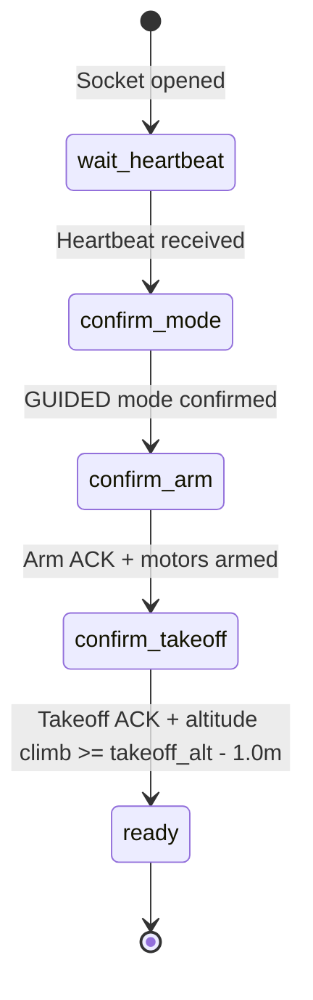
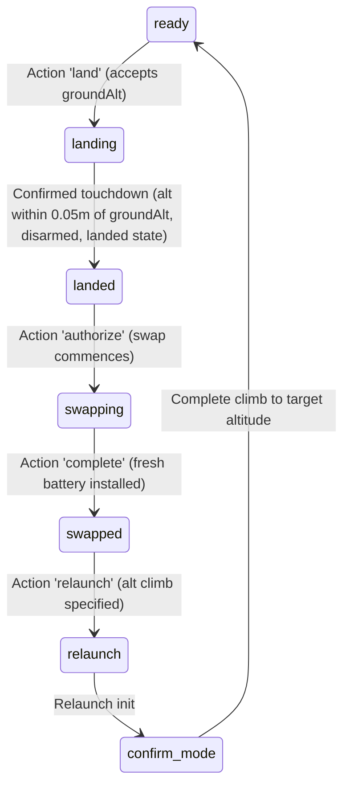
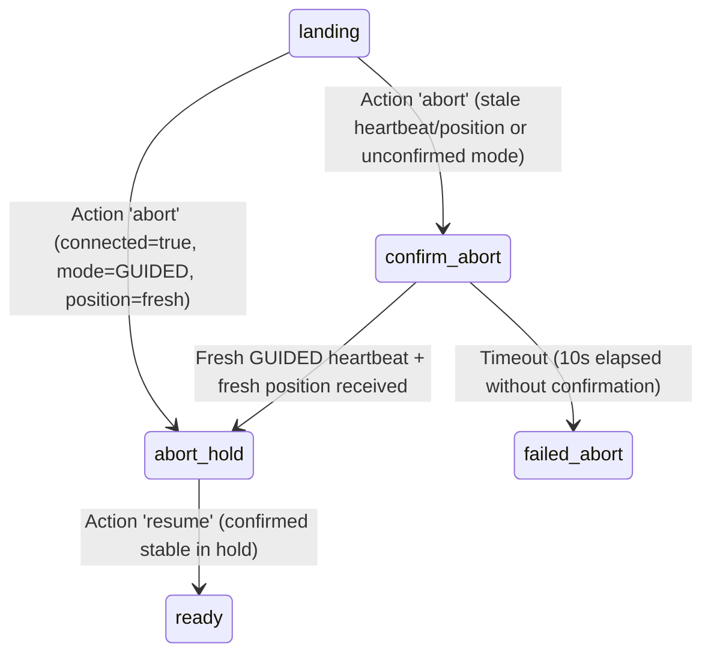

# Browser–Bridge Protocol Specification

Version: 1.1 (September 2026)
Scope: Communication contract between the web-based swarm simulator (`js/external.js`) and external vehicle servers (`sitl/bridge.py` and `sitl/mock_vehicles.py`).

---

## 1. Overview and Architecture

The simulator supports flying simulated or real physical drones via an external bridge over a single full-duplex WebSocket connection.

```
+-------------------+        WebSocket JSON       +-----------------------+
|                   |  <----------------------->  |                       |
|   Browser Sim     |     ws://localhost:8765     |  sitl/bridge.py       | <== MAVLink ==> SITL / Real Autopilots
| (js/external.js)  |                             |  sitl/mock_vehicles.py| (simulated point-mass dynamics)
+-------------------+                             +-----------------------+
```

Both server implementations MUST adhere strictly to this specification to ensure interoperability and prevent behavioral drift.

---

## 2. Coordinate Systems and Frames

### 2.1 Simulation Local Frame (`sim`)
- **X**: East, metres (positive right on standard canvas).
- **Y**: South, metres (positive down on standard canvas).
- **Alt**: Height above local ground level, metres (positive up).

### 2.2 Autopilot Local Frame (`LOCAL_NED`)
- **North**: Metres North (`-sim.y`).
- **East**: Metres East (`+sim.x`).
- **Down**: Metres Down (`-sim.alt` relative to origin elevation).

### 2.3 Common Local Origin
At connection/initialization time, the browser captures and establishes an immutable common local origin:
```json
{
  "frame": "common-local-origin",
  "x": 1000.0,
  "y": 500.0,
  "groundM": 250.0
}
```
All goal commands sent by the browser are origin-relative. All telemetry coordinates returned by the server are origin-relative.

---

## 3. Wire Protocol Messages

All messages are JSON objects with a mandatory `"type"` string field.

### 3.1 Client to Server Messages

#### `init`
Requests initialization and allocation of vehicles.
```json
{
  "type": "init",
  "count": 5,
  "alt": 30.0
}
```
- `count` (integer $\ge 0$): Number of vehicles to initialize (`DR-1` through `DR-N`).
- `alt` (float $> 1.0$): Default cruise/takeoff altitude in metres AGL.

#### `goals`
Commands waypoint setpoints for active vehicles. Sent periodically (e.g. 5–10 Hz).
```json
{
  "type": "goals",
  "goals": [
    { "id": "DR-1", "x": 120.5, "y": -45.0, "alt": 30.0 },
    { "id": "DR-2", "x": 150.0, "y": -30.0, "alt": 30.0 }
  ]
}
```
- Goals for unknown, unready, disconnected, or servicing vehicles MUST be safely ignored.

#### `service`
Commands lifecycle and service transitions (landing, battery swap, relaunch, abort, resume).
```json
{
  "type": "service",
  "id": "DR-1",
  "requestId": "svc-92a4f10",
  "action": "land",
  "groundAlt": 0.0,
  "alt": 30.0
}
```
- `id` (string): Vehicle identifier.
- `requestId` (string): Unique UUID or token identifying this service transaction.
- `action` (string): One of `"land"`, `"authorize"`, `"complete"`, `"relaunch"`, `"abort"`, `"resume"`.
- `groundAlt` (optional float): Local touchdown elevation relative to launch origin (used in `"land"`).
- `alt` (optional float): Desired climb above touchdown elevation in metres (used in `"relaunch"`).

---

### 3.2 Server to Client Messages

#### `ready`
Sent in response to `"init"`, once all initial vehicles are registered and report individual states.
```json
{
  "type": "ready",
  "ids": ["DR-1", "DR-2"],
  "vehicles": [
    { "id": "DR-1", "ready": true, "state": "ready" },
    { "id": "DR-2", "ready": false, "state": "confirm-arm" }
  ],
  "origin": { "frame": "common-local-origin", "x": 0.0, "y": 0.0, "groundM": 0.0 }
}
```

#### `telemetry`
Broadcast periodically (typically 10 Hz) with live state of all active vehicles.
```json
{
  "type": "telemetry",
  "time": 12.35,
  "vehicles": [
    {
      "id": "DR-1",
      "x": 12.0,
      "y": -8.0,
      "alt": 30.0,
      "vx": 0.0,
      "vy": 0.0,
      "ready": true,
      "state": "ready",
      "connected": true,
      "armed": true,
      "airborne": true,
      "landed": false,
      "positionSeq": 42,
      "positionAge": 0.05,
      "heartbeatAge": 0.1,
      "serviceId": null,
      "servicePhase": null
    }
  ]
}
```

#### `service_ack`
Machine-readable acknowledgment dispatched immediately upon receiving any `"service"` message.
```json
{
  "type": "service_ack",
  "requestId": "svc-92a4f10",
  "id": "DR-1",
  "action": "land",
  "accepted": true,
  "duplicate": false,
  "code": null,
  "error": null,
  "retryable": false
}
```
- `accepted` (boolean): Whether the request was validated and adopted.
- `duplicate` (boolean): `true` if this `(requestId, action)` was previously processed and accepted.
- `code` (string, optional): Machine-readable error code on failure (e.g. `INVALID_PHASE`, `HOLD_NOT_READY`, `VEHICLE_NOT_READY`, `BAD_ALTITUDE`).
- `retryable` (boolean): `true` if the failure is temporary and can succeed on vehicle state change.
- `error` (string, optional): Human-readable diagnostic description.

#### `status`
Advisory informational or diagnostic log text.
```json
{
  "type": "status",
  "msg": "vehicle DR-1: abort confirmed in GUIDED, holding at (120.0, 80.0, 10.0)"
}
```

---

## 4. Freshness and Timing Rules

| Constant | Value | Purpose |
|---|---|---|
| `HEARTBEAT_STALE_S` | 3.0 s | Max allowed age of vehicle heartbeat before link is declared dead / disconnected |
| `POSITION_STALE_S` | 3.0 s | Max allowed age of vehicle position before position is declared stale |
| `INIT_STEP_TIMEOUT_S`| 10.0 s | Timeout before unconfirmed lifecycle step fails (transitions to `failed:<step>`) |
| `STEP_RESEND_DT` | 2.0 s | Interval between re-sending unconfirmed MAVLink commands (e.g. mode, arm) |
| `EXT_LOST_DEAD_SEC` | 10.0 s | Browser simulation time after stale loss before a missing drone is marked `dead` |
| `SERVICE_THROTTLE_S`| 0.5 s | Browser rate limit between retries of identical service actions |
| `MAX_SERVICE_RETRIES`| 5 attempts| Browser maximum retries before transitioning service transaction to `failed` |

---

## 5. Lifecycle and Service State Machine

### 5.1 Initialization Flow


### 5.2 Battery Swap Handshake


### 5.3 In-Flight Abort Handshake


- While in `confirm-abort` or `abort-hold`, all mission goals are strictly suppressed.
- No automatic arming or takeoff commands may be issued from `abort-hold` or `aborted`.

---

## 6. Conformance & Drift Prevention Requirements

Both `sitl/bridge.py` and `sitl/mock_vehicles.py` must pass the unified conformance suite `sitl/test_protocol_conformance.py` asserting:
1. Exact JSON schema for `ready`, `telemetry`, and `service_ack`.
2. Idempotent duplicate request suppression for accepted actions.
3. Non-caching of retryable rejections.
4. Elevation datum conversion for relaunch (`takeoff_alt = launch_alt + requested_alt`).
5. Touchdown detection relative to local `groundAlt`.
6. Stale heartbeat gating: abort confirmation and hold setpoints require fresh heartbeat evidence (`connected=true`).
